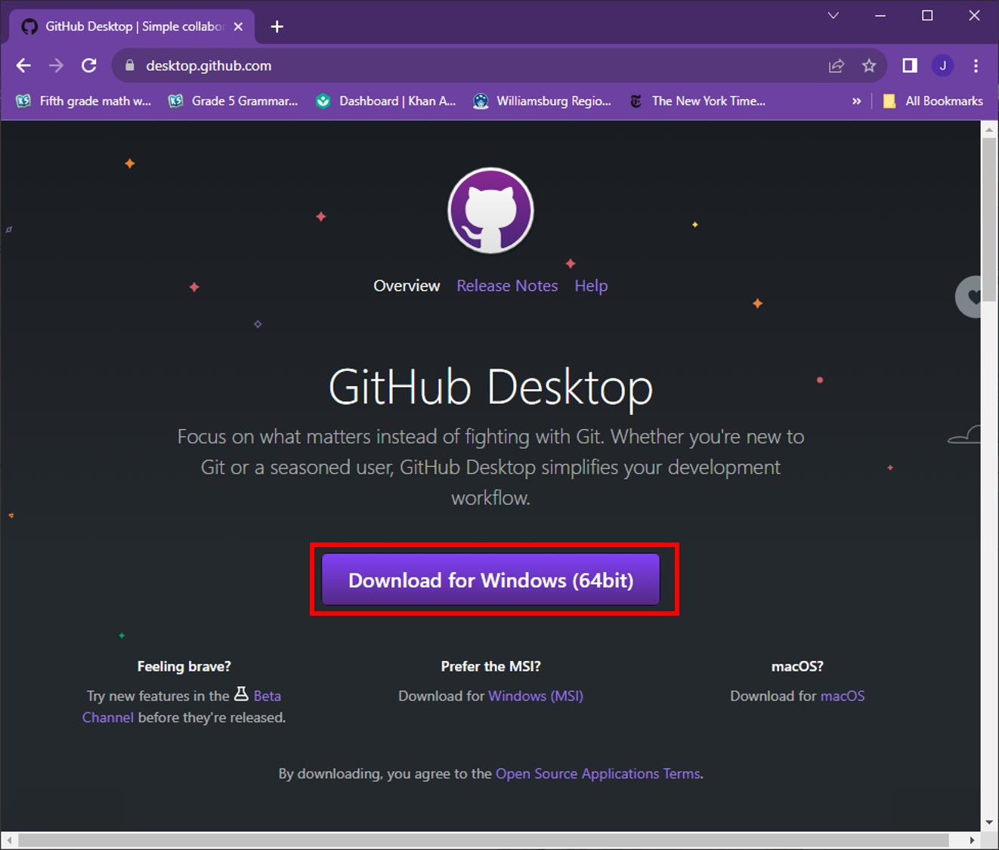
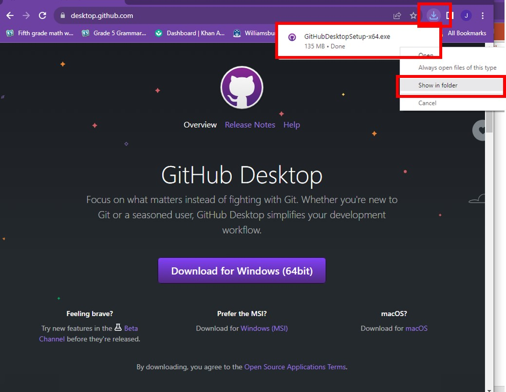
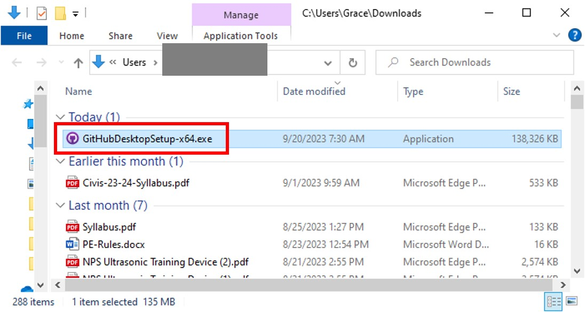
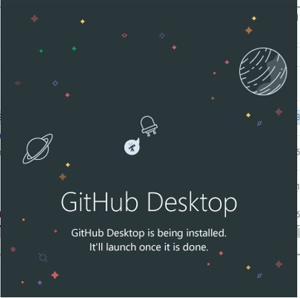
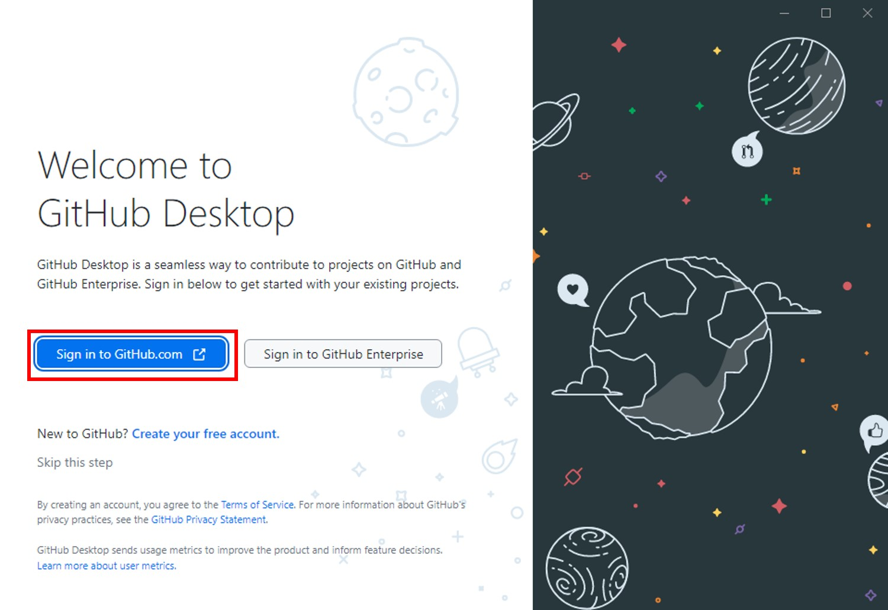
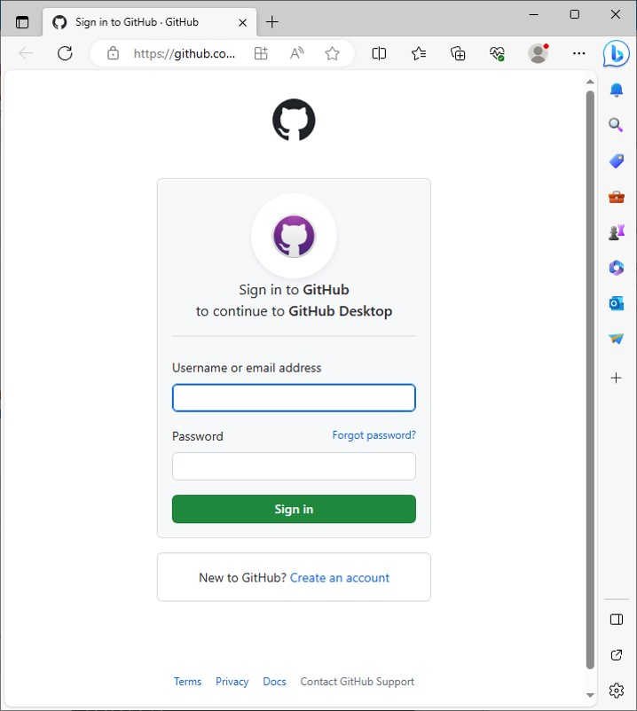
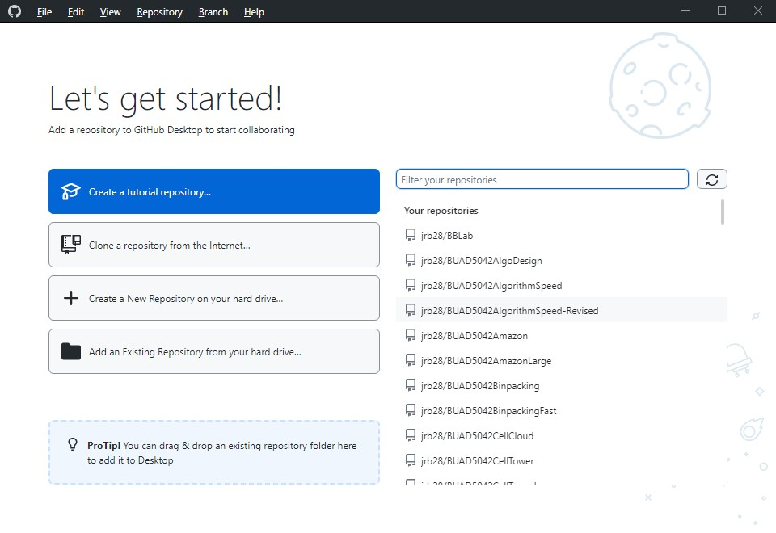

# Introduction

This markdown document is a tutorial to help a team of developers get started with development via GitHub.  Step-by-step instructions are supplemented with videos and other media demonstrating the steps.  The videos are hosted on YouTube, and you will need to either (i) right-click and choose <code>Open Video in New Tab</code> or (ii) click on the "back" arrow to get back to this markdown document.

When progressing through this tutorial, you may want to keep this set of directions on one side of your screen and the repository in which the tutorial is being executed on the other half of the screen.

A Python program using the <code>pandas</code> package is the target for development in this tutorial, but the focus is on learning the development process in GitHub rather than learning to code with Python and <code>pandas</code>, and so a solution is provided for the code to permit this exercise to be appropriately focused.  

# An Introduction to Collaborative Development

# The Tutorial

This tutorial is intended as a collaborative exercise and, so you will need at least two people to complete it.  

## Establish a GitHub Account

Any team member who does not have a GitHub account must establish one by going to [https://github.com](https://github.com) and clicking on <code>Sign up</code>

## Install GitHub Desktop Application

- Download and install the app from this URL:

<a href="https://desktop.github.com/" target="_blank">https://desktop.github.com/</a>

- Click where indicated to download the executable installation file as shown below.

- Navigate to the download folder

- Double-click to execute the installation file

- This image will appear during installation

- This is the welcome screen.  Click where indicated.

- Sign in with your GitHub account credentials

- If you have two-factor authentication enabled, then you will need to enter a passcode now.

- Configuration: enter your GitHub username and email address that you used to establish your account.

- Congratulations, you have finished the installation.  This is the GitHub Desktop app welcome screen.  This is the only time you will see this screen format and, in the future, you will use the menu to perform all the tasks whose links appear here.  You can just leave this window open.

## Create a GitHub Repository for this Tutorial

Identify one team member who will do the following:

-  Create a repository, named <code>github_tut</code>, in which to conduct this tutorial following the steps taken in the video below.  Please be aware that GitHub requires repository owners to have two-factor authentication and so you will need to set this feature up as well.  The author uses Google Authenticator with good results.

- Get these files from the <code>code</code> folder of this repository (repo) and upload them to the <code>github_tut</code> repo that was just created at <code>https://github.com/_your_github_username_/github_tut</code>.
  - github.py
  - github_soln.py
  - DECENNIALPL2020.P1_data_with_overlays_2021-11-05T143124_mod.csv
-  Communicate the repository URL, <code>https://github.com/_your_github_username_/github_tut</code>, to all teammates
-  Give write permission for the repo to teammates by going to <code>Settings>Collaborators</code> on the GitHub web repo page and entering the GitHub IDs of teammates as described in the video below.

   
## Accept Collaboration Invitation and Clone Repo

Each teammate should do the following:

- Accept the invitation from repo owner, which will be sent to the email address you specified when establishing your GitHub account as demonstrated in the video below.

- Go to the owner’s repo URL and create a new branch.  Embed your GitHub username in the branch name so that you can identify your work.

- Clone the repository onto your computer using the <code>Open with GitHub Desktop</code> option after clicking on the <code>Code</code> button as demonstrated in the video below.  Finally, navigate to the new branch you created in the GitHub Desktop app.

## A Little Bit About How Branches Work

As was mentioned, creating a branch essentially creates a redundant copy of the repo code from the <code>main</code> branch that we can safely edit.  However, there is never more than one <code>github.py</code> file.  Instead, git keeps a record of the differences between the <code>github.py</code> file in the different branches, and when we change branches, git quickly revises the file for the branch that we choose in the GitHub Desktop app.  This is demonstrated in the video below.

## Edit the Python Code and Push Your changes to the Internet Repo

The video below illustrates all the steps in this section.  Feel free to watch the video, stopping it at each step to perform the steps along with the video.

-  In __the branch that you created__, edit the <code>github.py</code> file with Spyder by completing one of the functions that are used with the <code>DataFrame.apply()</code> statements to create a new column in the <code>DataFrame</code> named <code>df</code> and also “un-comment” the corresponding <code>DataFrame.apply()</code>statement (delete the pound sign) that uses the function that you edited.  To find the <code>github.py</code> file you will need to pay attention to the folder where GitHub Desktop has stored your cloned repos.
  -  If you want more details about the code go here: [code comments](coding.md)
  -  If you want to focus on the GitHub process and not spend the time to figure out the function and the <code>DataFrame.apply()</code> statements, then you may use the code in the <code>github_soln.py</code> file to make your revisions quickly.
-  Save your changes in Spyder and test your revised code in Spyder to ensure that it works
-  In GitHub Desktop <code>Commit</code> the code change to the branch
-  Then <code>Push to Origin</code> (this changes the code in the Internet repo to reflect your additions)
-  In GitHub Desktop, click on <code>Create Pull Request</code>.  Subsequently, do the same in the browser window.

## Review Pull Requests and Merge Branches

All team members should participate in a Zoom call where the team member who owns the repository reviews and approves the pull requests using these steps for the pull request from each team member.  the video below illustrates all the steps shown below.

- Click on <code>Pull Requests</code> in the menu at the top of the web repo page
-	Click on a specific pull request
-	Click on <code>Merge Pull Request</code>
-	Click on <code>Confirm Merge</code>
-	Click on <code>Delete Branch</code>
-	Leave a <code>comment</code>

# Conclusion

This tutorial contains the fundamentals needed to get started with collaborative development on GitHub but further skills are needed to become more proficient.  The next steps that could be taken in that regard are the following:

- Reverting to earlier versions of the repo
- Learning to set permissions for approving pull requests
- Learning effective etiquette in making comments to document pull requests
- Learning to manage pull requests when conflicts exist

