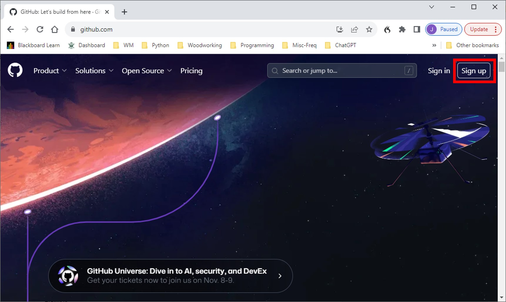

# Introduction

This markdown document is a tutorial to help a team of developers get started with development via GitHub.  Step-by-step instructions are supplemented with videos and other media demonstrating the steps.  The videos are hosted on YouTube, and you will need to either (i) right-click and choose <code>Open Video in New Tab</code>, or (ii) click on the "back" arrow to get back to this markdown document.

A Python program using the <code>pandas</code> package is the target for development in this tutorial, but the focus is on learning the development process in GitHub rather than learning to code with Python and <code>pandas</code>, and so a solution is provided for the code to permit this exercise to be appropriately focused.  

# An Introduction to Collaborative Development

# The Tutorial

This is intended as a collaborative exercise, and so you will need a team of at least two people for this tutorial.  

## Establish GitHub Accounts

Any team member who does not have a GitHub account must establish one by going to [https://github.com](https://github.com)

## Create a GitHub Repository for Development

Of the team members, identify one team member who will do the following:

-  Create a repository, named <code>github_tut</code>, in which to conduct this tutorial following the steps taken in the video below.

xxx embed centered youtube video xxx

- Get these files from xxxxxx and upload them to the <code>github_tut</code> repository (repo) at <code>https://github.com/_your_github_username_/github_tut</code>.
  - github.py
  - github_soln.py
  - DECENNIALPL2020.P1_data_with_overlays_2021-11-05T143124_mod.csv
-  Communicate the repository URL to all teammates
-  Give write permission for the repo to teammates by going to <code></code>Settings>Collaborators</code> on the GitHub web repo page and entering the GitHub IDs of teammates.

## Accept Collaboration Invitation and Clone Repo

Each teammate should do the following:

- Accept the invitation from repo owner, which will be sent to the email address you specified when establishing your GitHub account.
- Go to owner’s repo and create new branch.  Embed your GitHub username in the branch name so that you can identify your work.
- xxxx Clone the repository onto your computer and choose the <code>Open with GitHub Desktop</code> option by clicking on the xxxxx button as demonstrated in the video below.  If you do not have the GitHub Desktop app, then you will be prompted to download and install it.
-  xxx embed video
-  In GitHub Desktop, navigate to the new branch you created
-  xxx embed video
-  Edit the code by completing one of the functions used to create a new column in the DataFrame programmed in the github.py file, and “un-comment” the corresponding statement used to create a new column in the DataFrame, that is, delete the pound sign
-  xxx link to details about the code
-  Test your code revision to ensure that it works
-  In GitHub Desktop Commit the code change to the branch
-  xxxx
-  Then <code>Push Changes</code> to Origin (this changes the code in the Internet repo to reflect your additions)
-  xxxxxx
-  In GitHub Desktop, click on <code>Create Pull Request</code>
xxxxx

## Review Pull Requests and Merge Branches

All team members should participate in a Zoom call where the team member who owns the repository reviews and approves the pull requests using these steps for the pul request from each team member.

- Click on Pull requests in the menu at the top of the web repo page
- xxx image
-	Click on the pull request to see details
-	xxx image
-	Click on Files Changed to see revisions
-	xxx image
-	Click back to Conversation
-	xxx image
-	Click on Merge Pull Request
-	xxx image
-	Click on Confirm Merge
-	xxx image
-	Click on Delete Branch
-	xxx image

# Conclusion

This tutorial contains the fundamentals needed to get started with collaborative development on GitHub but further skills are needed to become more proficient.  The next steps that could be taken in that regard are the following:

- Learning to set permissions for approving pull requests
- Learning effective etiquette in making comments to document pull requests
- Learning to manage pull requests when conflicts exist

